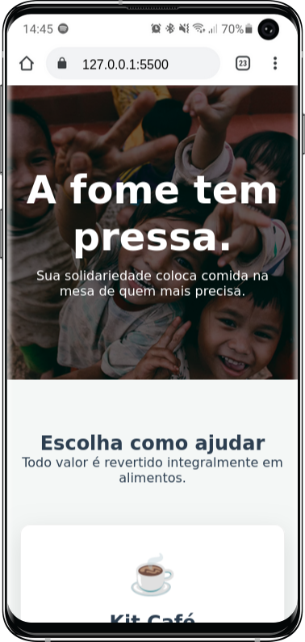
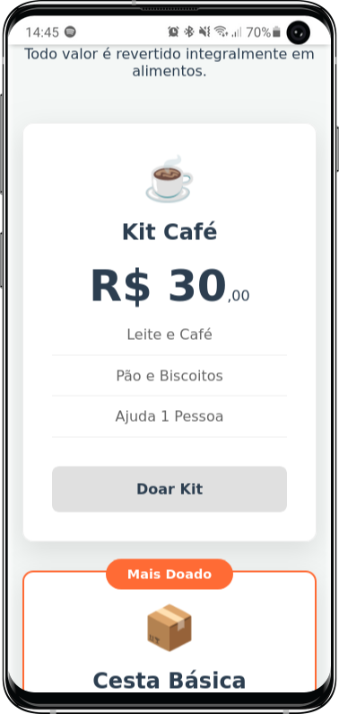
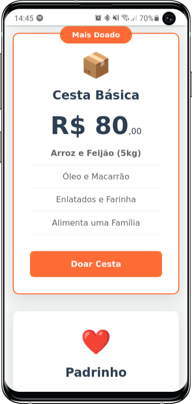
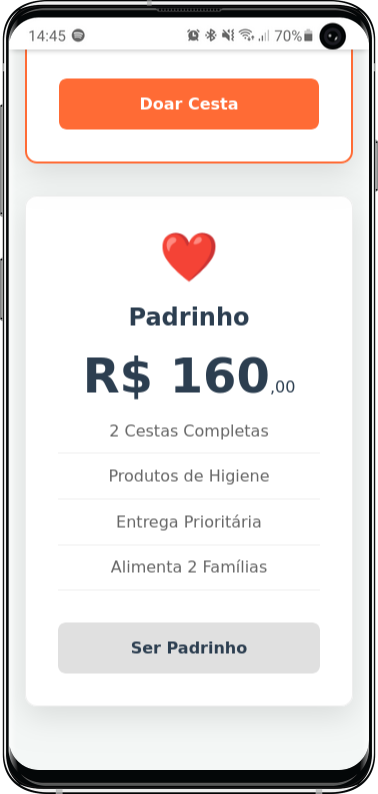

# 🍲 Food Donation Landing Page

Uma Landing Page responsiva e de alta conversão para campanhas de arrecadação de alimentos.
Desenvolvida com foco em UX, transparência e facilidade de doação (Pix Modal).

## 🚀 Tecnologias
- HTML5 Semântico
- CSS3 (Flexbox, Grid Layout, Custom Variables)
- JavaScript (DOM Manipulation para Modal)

## ✨ Funcionalidades
- Layout Responsivo (Mobile First)
- Modal Interativo com QR Code
- Cards de Doação com destaque visual
- Efeito de Glassmorphism (no Modal)

## 📸 Preview

### Desktop


### Mobile
<div style="display: flex; flex-direction: row;">
    
    
    
    
</div>

## 📂 Como rodar o projeto
1. Clone o repositório:
   ```bash
   git clone https://github.com/Eduardo377/cesta-solidaria-front.git